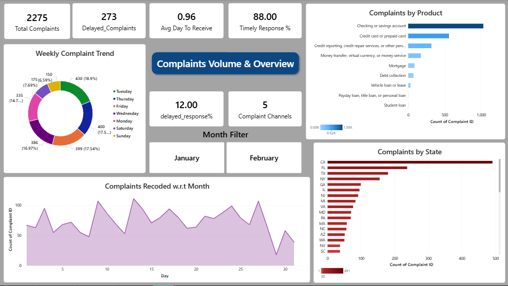
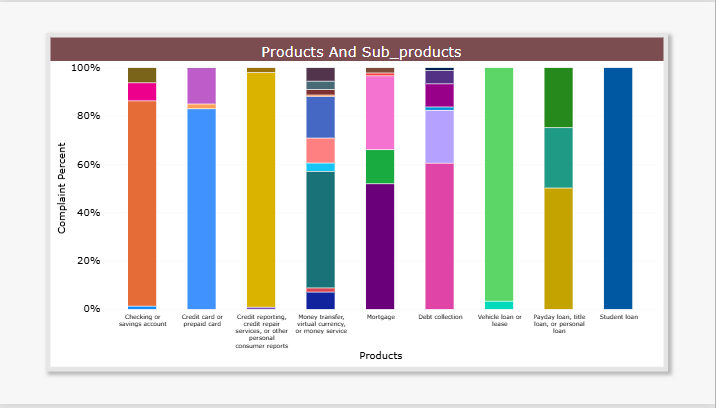
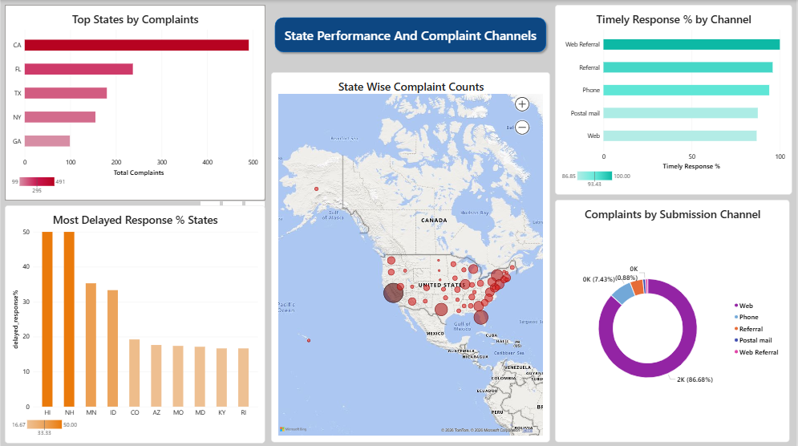

# 📊 Consumer Financial Complaints Analysis : CFPB USA

> **Tools:** SQL · MySQL Workbench · Power BI
> **Dataset:** US Consumer Financial Protection Bureau (CFPB) : Jan & Feb 2023
> **Records:** 2,275 complaints · 9 product categories · 45 states · 5 submission channels

---

## 📌 Project Overview

This project analyses real consumer financial complaint data published by the **US Consumer Financial Protection Bureau (CFPB)** : a US government agency that supervises banks, lenders, and financial companies.

The goal was to identify complaint patterns, pinpoint high-risk products and states, evaluate company response quality, measure resolution timelines, and visualise findings through a 4-page interactive Power BI dashboard including geographical mapping.

---

## 🗂️ Dataset Details

| Attribute | Details |
|---|---|
| Source | Consumer Financial Protection Bureau (CFPB) : Public Dataset |
| Period | January – February 2023 |
| Total Records | 2,275 complaints |
| Products | 9 (Mortgage, Credit Card, Checking/Savings, Money Transfer, etc.) |
| States Covered | 45 |
| Submission Channels | Web, Phone, Referral, Postal Mail, Web Referral |
| Avg Days to Receive | 0.96 days |

---

## 🔑 Key Business Questions Answered

| # | Question | Finding |
|---|---|---|
| Q1 | Which product has highest complaints? | Checking/Savings Account : 1,029 complaints |
| Q2 | Top 5 states by complaints? | CA: 491 · FL: 237 · TX: 180 · NY: 155 · GA: 99 |
| Q3 | Which channel receives most complaints? | Web : 1,972 (86.68%) |
| Q4 | What is the delayed response rate? | 273 complaints (12%) : no timely response |
| Q5 | Most common issue across all products? | Managing an Account : 544 complaints |
| Q6 | Which product has most sub-products? | Money Transfer : 10 distinct sub-products |
| Q7 | Which states have worst delayed response %? | HI and NH : highest delayed response rates |
| Q8 | Monthly complaints per day comparison? | Feb: 39.0/day vs Jan: 38.16/day |
| Q9 | Which product has highest delayed response %? | Payday Loan : highest delayed response % |
| Q10 | Most common sub-issue? | Deposits and Withdrawals : 288 complaints |

---

## 🛠️ SQL Techniques Used

- `GROUP BY` with `COUNT` and `SUM` for aggregations
- `WINDOW FUNCTIONS` : `SUM() OVER(PARTITION BY ...)` for running totals
- `CTEs` (Common Table Expressions) for modular query building
- `HAVING` with `COUNT(DISTINCT)` for sub-product complexity analysis
- `LAST_DAY()` date function for complaints-per-day calculation
- `WHERE` filters for delayed response isolation and receipt time flagging
- `DAYNAME()` for weekly complaint trend analysis
- Multi-level `ORDER BY` for ranked state, product, and issue insights

---

## 📈 Power BI Dashboard : 4 Pages

### Page 1 : Complaints Volume & Overview

- **KPI Cards:** Total Complaints (2,275), Delayed Complaints (273), Avg Days to Receive (0.96), Timely Response % (88.00), Delayed Response % (12.00), Complaint Channels (5)
- **Weekly Complaint Trend** : donut chart showing complaint distribution by day of week
- **Complaints Recorded w.r.t Month** : area chart showing daily complaint volume across Jan–Feb
- **Complaints by Product** : horizontal bar: Checking/Savings Account leading at 1,029
- **Complaints by State** : bar chart: CA dominant at 491
- **Month Filter Slicer** : interactive January / February toggle

---

### Page 2 : Product Analysis

- **Complaints by Product** : ranked horizontal bar across all 9 product categories
- **Complaints by Sub-Issues** : top 10 sub-issues: Deposits & Withdrawals (288), Account opened as result of fraud (181)
- **Complaints by Issues** : Managing an Account leading at 544; Opening an Account second at 190
- **Product Issues & Complaints Treemap** : hierarchical visual showing issue distribution within each product category : most complex visual in the dashboard

---

### Page 3 : Response Performance

- **Issue Severity Matrix** : scatter plot: complaint volume vs avg days to receive, split by timely/not timely response
- **Delayed Responses by Product** : bar chart: Payday Loan has highest delayed response %; Student Loan lowest
- **Company Response Matrix** : scatter plot: volume vs resolution time broken down by response type (Closed with explanation, monetary relief, non-monetary relief)

---

### Page 4 : State Performance & Complaint Channels

- **Top States by Complaints** : horizontal bar: CA (491), FL (237), TX (180), NY (155), GA (99)
- **Most Delayed Response % States** : HI and NH showing ~50% delayed response rate : geographic performance gaps identified
- **State Wise Complaint Counts MAP** : geographical bubble map showing complaint density across US states : CA, FL, TX clearly visible as hotspots
- **Timely Response % by Channel** : Web Referral and Referral channels show 100% timely response; Web at 86.85%
- **Complaints by Submission Channel Donut** : Web: 86.68% · Phone: 7.43% · Referral · Postal Mail · Web Referral

---

## 💡 Key Insights

1. **Checking/Savings Account** drives 45% of all complaints : highest priority product for resolution improvement
2. **California alone** accounts for 42.25% of top-5 state complaints with highest absolute delayed responses (64)
3. **HI and NH** have the worst delayed response rates (~50%) despite lower complaint volumes : regional service gaps
4. **Payday Loan** products have the highest delayed response % : high-risk product category for compliance
5. **88% timely response rate overall** : but 273 cases unresolved on time represent measurable operational risk
6. **Web channel dominates** at 86.68% : digital complaint infrastructure is critical for financial institutions
7. **Managing an Account** is the most common issue (544) : onboarding and account management processes need improvement
8. **Avg 0.96 days to receive** : near same-day complaint logging shows efficient intake process
9. **Web Referral and Referral channels** achieve 100% timely response : best performing channels for resolution quality

---

---

## 👤 Author

**Shantanu Rudresh Wale**
Data Analyst | Pune, Maharashtra
📧 wale.shantanu2001@gmail.com
🔗 [GitHub Profile](https://github.com/Shantanu-Wale)

---

*Dataset sourced from the US Consumer Financial Protection Bureau (CFPB) public complaints database.*
